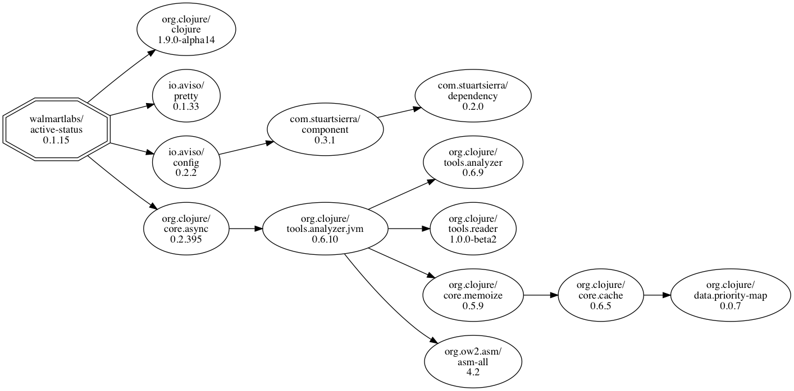
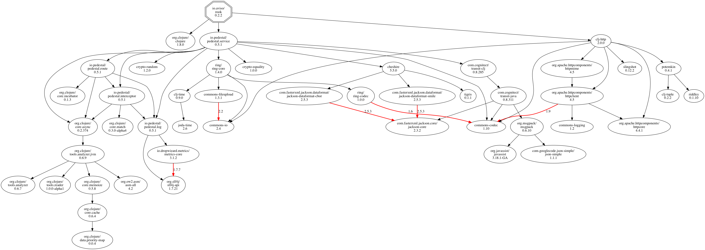

# walmartlabs/vizdeps

An alternative to `lein deps :tree` that uses [Graphviz](http:://graphviz.org) to present
a dependency diagram of all the artifacts (Maven-speak for "libraries") in your project.

Here's an example of a relatively small project:



A single artifact may be
a transitive dependency of multiple other artifacts.
*vizdeps* can show this (`lein deps :tree` doesn't), and will highlight in red any dependencies
with a version mismatch.
This can make it *much* easier to identify version conflicts and provide the best
exclusions and overrides.

These dependency graphs can get large; using the `--vertical` option may make large
trees more readable.



To keep the graph from getting any more cluttered, the `org.clojure/clojure` artifact
is treated specially (just the dependency from the project root is shown).

## Usage

Put `[walmartlabs/vizdeps "0.1.3"]` into the `:plugins` vector of your `:user`
profile.

```
Usage: lein vizdeps [options]

Options:
  -o, --output-file FILE    target/dependencies.pdf  Output file path. Extension chooses format: pdf or png.
  -s, --save-dot                                     Save the generated GraphViz DOT file well as the output file.
  -n, --no-view                                      If given, the image will not be opened after creation.
  -H, --highlight ARTIFACT                           Highlight the artifact, and any dependencies to it, in blue.
  -v, --vertical                                     Use a vertical, not horizontal, layout.
  -d, --dev                                          Include :dev dependencies in the graph.
  -h, --help                                         This usage summary.
```
  
## License

Copyright © 2016-2017 Walmartlabs

Distributed under the Apache Software License 2.0.
